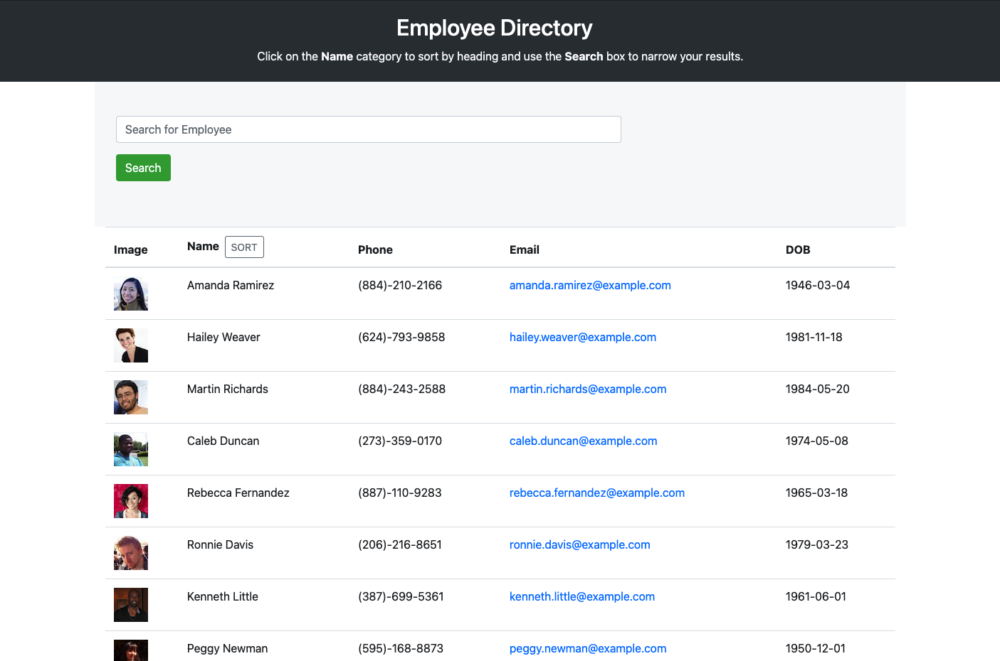

# Employee 👩‍💻 Directory

## Description
Employee Directory is a sort and filter employee directory app, built using create-react-app

## Table of Contents
* [Installation](#installation)
* [Usage](#usage)
* [Resources](#resources)
* [Credits](#credits)
* [License](#license)
* [Contributing](#contributing)
* [Questions](#questions)

## Installation
### Steps required to run locally
1. Clone/download the code in this repo
2. Navigate to the location of the code downloaded
4. Run `npm install` to add required packages
5. Setup dependencies
5. Run `npm start`
5. Open your browser to localhost with the port address
### Steps required to run online
Click this link to [VIEW APP](https://stopdaydreaming.github.io/expert-employee-directory/)

## Usage 
This code should be used for the purpose of creating/editing code for a Employee Directory app. 
   

## Credits
1 contributor: @stopdaydreaming  
special thanks to my amazing tutor.

## License
Copyright (c) Employee Directory. All rights reserved.
Licensed under the [MIT](LICENSE) license.

## Features
None at this time

## Contributing
None at this time

## Tests
None at this time  

## Badges
